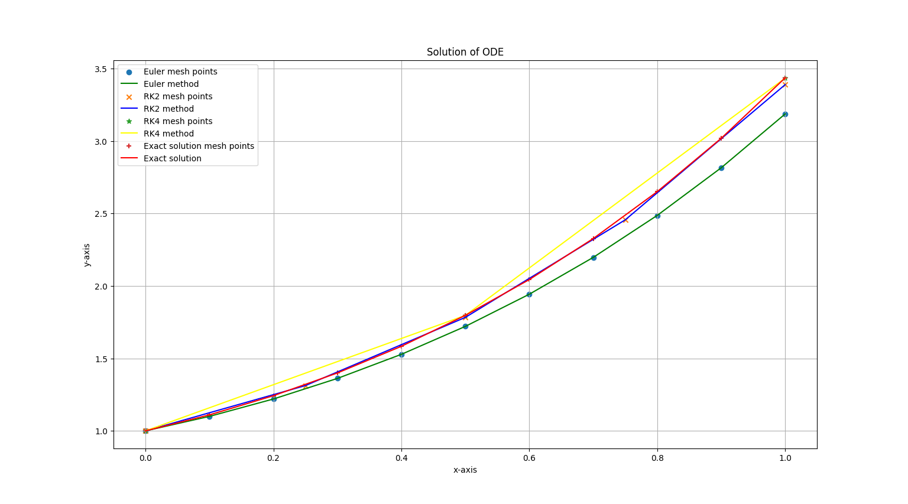

# Numerical Solutions for Ordinary Differential Equations (ODEs)

This Python project solves a first-order Ordinary Differential Equation (ODE) using three different numerical methods and compares them against the exact analytical solution.

### Differential Equation:
$$\frac{dy}{dx} = x + y \quad \text{with initial condition } y(0) = 1$$

### Analytical Solution:
$$y(x) = 2e^x - x - 1$$

---

## 🛠️ Numerical Methods Implemented
1. **Euler's Method** 
2. **Runge-Kutta 2nd Order (RK2)** 
3. **Runge-Kutta 4th Order (RK4)**
4. **Exact Analytical Solution**

---

## 💻 Terminal Output
```console
Enter n for Euler: 10
Enter n for RK2: 4
Enter n for RK4: 2
Enter n for real: 10

The solution at x = 1 using different methods are:
Exact solution : 3.437
Euler          : 3.187
RK2            : 3.390
RK4            : 3.435
```

---

## 📊 Graphical Comparison
Below is the visualization plot generated by the code showing the mesh points and solution curves for each method compared to the exact solution:



